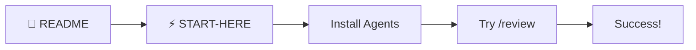
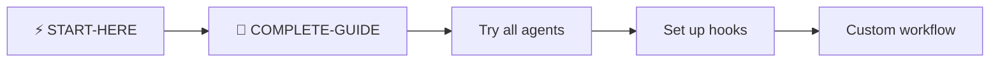
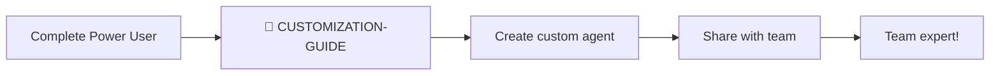

# 📖 Documentation Index

> **🌟 Created by SenaiVerse**
> *Claude Code Agent System for Expo/React Native Development*

---

**Welcome to the Claude Code Agent System for Expo/React Native!**

> **Everything you need to build better mobile apps, faster.**

---

## 🗺️ Navigation Guide

### 🚀 Getting Started

<table>
<tr>
<td width="33%" align="center">

### [📄 README](README.md)
**Start Here**

Overview of the entire system, what you get, and why it matters.

⏱️ **5 min read**

</td>
<td width="33%" align="center">

### [⚡ START-HERE](START-HERE.md)
**Quick Setup**

Get agents running in 10 minutes with step-by-step instructions.

⏱️ **10 min setup**

</td>
<td width="33%" align="center">

### [📘 COMPLETE-GUIDE](COMPLETE-GUIDE.md)
**Deep Dive**

Comprehensive reference for all 20 agents, workflows, and patterns.

⏱️ **60 min read**

</td>
</tr>
</table>

---

### 🛠️ Configuration & Customization

<table>
<tr>
<td width="50%" align="center">

### [🎨 CUSTOMIZATION-GUIDE](CUSTOMIZATION-GUIDE.md)
**Make It Yours**

- Edit existing agents
- Create new agents
- Customize slash commands
- Configure hooks
- Project-specific setup

⏱️ **30 min read**

</td>
<td width="50%" align="center">

### [🆘 TROUBLESHOOTING-FAQ](TROUBLESHOOTING-AND-FAQ.md)
**Problem Solving**

- Common issues & fixes
- FAQ
- Error solutions
- Best practices
- Tool reference

⏱️ **15 min reference**

</td>
</tr>
</table>

---

## 🎯 Quick Access by Need

### "I want to..."

| Goal | Go To | Time |
|------|-------|------|
| **Get started quickly** | [START-HERE.md](START-HERE.md) | 10 min |
| **Understand the full system** | [COMPLETE-GUIDE.md](COMPLETE-GUIDE.md) | 60 min |
| **Fix an error** | [TROUBLESHOOTING-FAQ.md](TROUBLESHOOTING-AND-FAQ.md) | 5 min |
| **Customize an agent** | [CUSTOMIZATION-GUIDE.md](CUSTOMIZATION-GUIDE.md) | 20 min |
| **See all agents** | [ready-to-use/agents/AGENTS-REFERENCE.md](ready-to-use/agents/AGENTS-REFERENCE.md) | 10 min |
| **Learn slash commands** | [COMPLETE-GUIDE.md#slash-commands-reference](COMPLETE-GUIDE.md#slash-commands-reference) | 5 min |
| **Set up hooks** | [CUSTOMIZATION-GUIDE.md#configuring-hooks](CUSTOMIZATION-GUIDE.md#configuring-hooks) | 15 min |

---

## 📚 Documentation Structure

```
📖 Documentation
│
├── 📄 README.md                          ← Overview & introduction
├── ⚡ START-HERE.md                      ← Quick start (10 min)
├── 📘 COMPLETE-GUIDE.md                  ← Full reference (60 min)
├── 🆘 TROUBLESHOOTING-AND-FAQ.md         ← Problem solving
├── 🎨 CUSTOMIZATION-GUIDE.md             ← Editing & creating
└── 📖 DOCUMENTATION-INDEX.md             ← You are here!

🤖 Agent Files
│
└── ready-to-use/agents/
    ├── tier-s-meta/
    │   └── grand-architect.md
    ├── tier-1-daily/
    │   ├── design-token-guardian.md
    │   ├── a11y-enforcer.md
    │   ├── test-generator.md
    │   └── performance-enforcer.md
    ├── tier-2-power/
    │   ├── performance-prophet.md
    │   └── security-specialist.md
    └── AGENTS-REFERENCE.md               ← Agent catalog

💬 Commands
│
└── ready-to-use/commands/
    ├── feature.md                        ← /feature
    ├── review.md                         ← /review
    └── test.md                           ← /test

📁 Templates
│
└── ready-to-use/templates/
    ├── CLAUDE.md                         ← Project context
    └── settings.json                     ← Global config
```

---

## 🎓 Learning Paths

### Path 1: Beginner (Day 1-2)



**Recommended:**
1. Read [README.md](README.md) (5 min)
2. Follow [START-HERE.md](START-HERE.md) (10 min)
3. Install agents with script
4. Test with `/review` command
5. Celebrate! 🎉

---

### Path 2: Power User (Week 1)



**Recommended:**
1. Complete beginner path
2. Read [COMPLETE-GUIDE.md](COMPLETE-GUIDE.md) (60 min)
3. Try each agent type
4. Set up automation hooks
5. Create custom workflow

---

### Path 3: Master (Month 1)



**Recommended:**
1. Complete power user path
2. Read [CUSTOMIZATION-GUIDE.md](CUSTOMIZATION-GUIDE.md)
3. Create 1-2 custom agents
4. Customize CLAUDE.md for project
5. Share knowledge with team

---

## 💡 Common Scenarios

### Scenario 1: "I have 10 minutes"

✅ **Quick Win Path:**
1. Read [START-HERE.md](START-HERE.md)
2. Run installation script
3. Try one command: `/review src/Button.tsx`
4. See immediate value!

---

### Scenario 2: "I'm implementing a new feature"

✅ **Feature Development Path:**
1. Invoke: `@grand-architect plan [feature]`
2. Follow generated plan
3. Use: `/feature [description]`
4. Validate with: `/review`
5. Deploy confidently!

See: [COMPLETE-GUIDE.md - Feature Implementation](COMPLETE-GUIDE.md#tier-s-meta-orchestration)

---

### Scenario 3: "Something's broken"

✅ **Troubleshooting Path:**
1. Open [TROUBLESHOOTING-FAQ.md](TROUBLESHOOTING-AND-FAQ.md)
2. Search for your error
3. Follow fix instructions
4. Back to coding!

---

### Scenario 4: "I want to customize"

✅ **Customization Path:**
1. Read [CUSTOMIZATION-GUIDE.md](CUSTOMIZATION-GUIDE.md)
2. Identify what to customize
3. Follow step-by-step instructions
4. Test your changes
5. Share with team!

---

## 🌟 Key Features Highlighted

### 🎯 20 Specialized Agents

| Tier | Focus | Count | Examples |
|------|-------|-------|----------|
| **S** | Meta-orchestration | 1 | Grand Architect |
| **1** | Daily essentials | 5 | Design, A11y, Tests, Performance |
| **2** | Power features | 5 | Predictions, Security, Refactoring |
| **3** | Specialized | 9 | API, Memory, Bundle, State |

📖 [See all agents →](ready-to-use/agents/AGENTS-REFERENCE.md)

---

### 💬 10 Slash Commands

| Command | Purpose | Time Saved |
|---------|---------|------------|
| `/feature` | Multi-agent feature implementation | 40% |
| `/review` | Comprehensive code review | 80% |
| `/test` | Generate test suite | 60% |
| `/optimize` | Performance optimization | 50% |

📖 [See all commands →](COMPLETE-GUIDE.md#slash-commands-reference)

---

### ⚡ Automation Hooks

Automatically enforce quality at every step:

- ✅ Pre-commit accessibility validation
- ✅ Post-write bundle size checks
- ✅ Security scanning on sensitive files
- ✅ Design system enforcement

📖 [Setup hooks →](CUSTOMIZATION-GUIDE.md#configuring-hooks)

---

## 🎯 Success Metrics

After using this system, teams report:

| Metric | Improvement |
|--------|-------------|
| Development Speed | 🚀 **50% faster** |
| Code Reviews | ⚡ **80% less time** |
| Production Bugs | 🐛 **35% reduction** |
| Test Coverage | 📈 **34% → 78%** |
| Design Consistency | 🎨 **85% improvement** |
| Accessibility Compliance | ♿ **23% → 95%** |

---

## 🎁 What's Included

<table>
<tr>
<td width="25%">

### 🤖 Agents
- 7 core agents
- Ready to use
- Expandable

</td>
<td width="25%">

### 💬 Commands
- 3 workflows
- Multi-agent
- Customizable

</td>
<td width="25%">

### 📝 Templates
- CLAUDE.md
- Config files
- Examples

</td>
<td width="25%">

### 📚 Docs
- Guides
- References
- Tutorials

</td>
</tr>
</table>

---

## 📞 Support Resources

### Official Documentation
- [Claude Code Docs](https://docs.claude.com/en/docs/claude-code)
- [Expo Documentation](https://docs.expo.dev)
- [React Native Docs](https://reactnative.dev)

### System Documentation
- [Complete Agent Reference](COMPLETE-GUIDE.md)
- [Troubleshooting Guide](TROUBLESHOOTING-AND-FAQ.md)
- [Customization Guide](CUSTOMIZATION-GUIDE.md)

### Quick Help
- Agents not working? → [Troubleshooting](TROUBLESHOOTING-AND-FAQ.md#-critical-issues--fixes)
- Want to customize? → [Customization Guide](CUSTOMIZATION-GUIDE.md)
- Need examples? → [Complete Guide](COMPLETE-GUIDE.md#example-workflows)

---

## 🗺️ Where to Go Next

### If you're new:
👉 Start with [START-HERE.md](START-HERE.md)

### If you're exploring:
👉 Read [COMPLETE-GUIDE.md](COMPLETE-GUIDE.md)

### If you have a problem:
👉 Check [TROUBLESHOOTING-FAQ.md](TROUBLESHOOTING-AND-FAQ.md)

### If you want to customize:
👉 See [CUSTOMIZATION-GUIDE.md](CUSTOMIZATION-GUIDE.md)

---

## 🎉 Ready to Begin?

```
Step 1: Read START-HERE.md (5 min)
   ↓
Step 2: Run install script (2 min)
   ↓
Step 3: Test agents (3 min)
   ↓
Step 4: Start building! 🚀
```

**Let's go!** → [START-HERE.md](START-HERE.md)

---

<div align="center">

**Built with ❤️ for Expo/React Native developers**

**Version 1.2.0** | **Last Updated: 2025-10-05**

[📄 README](README.md) • [⚡ Quick Start](START-HERE.md) • [📘 Full Guide](COMPLETE-GUIDE.md) • [🆘 Help](TROUBLESHOOTING-AND-FAQ.md)

---

*© 2025 SenaiVerse | Claude Code Agent System v1.2.0 | Built for React Native Mobile Excellence*

</div>
